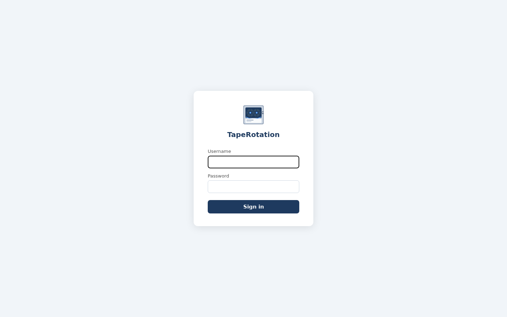
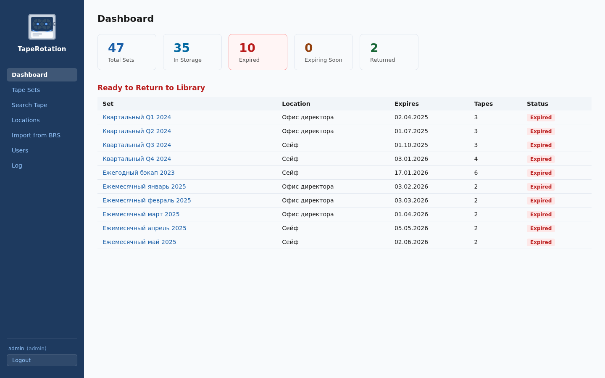
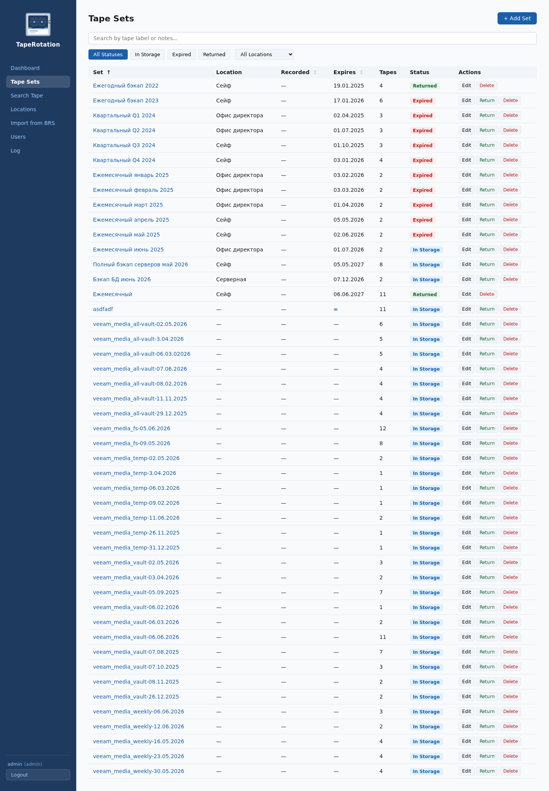
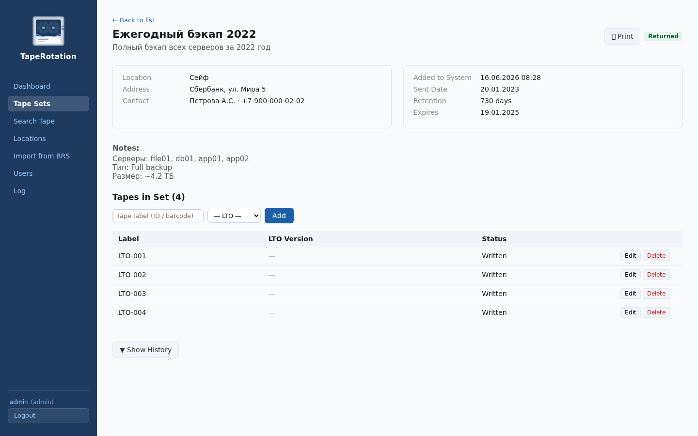
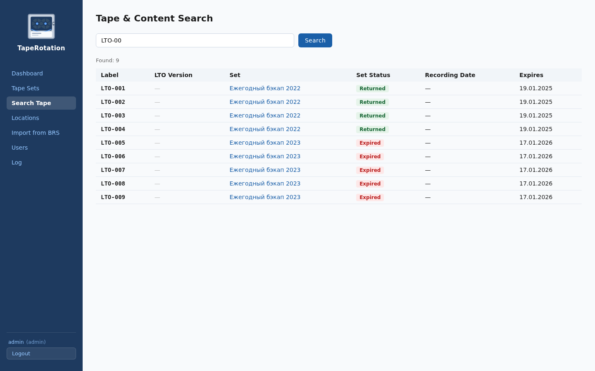
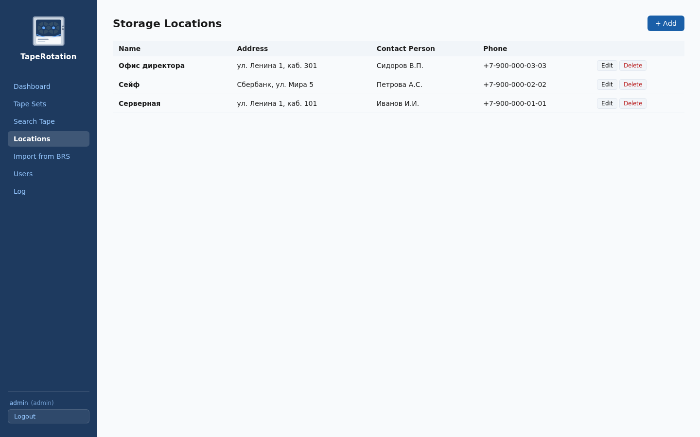
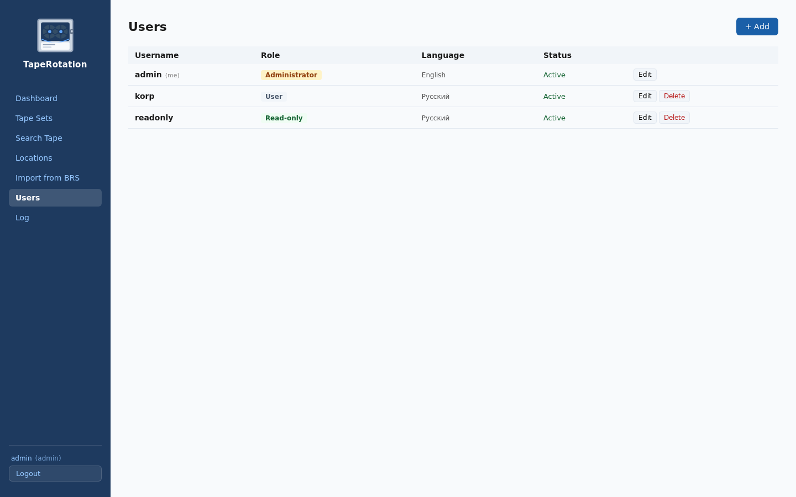
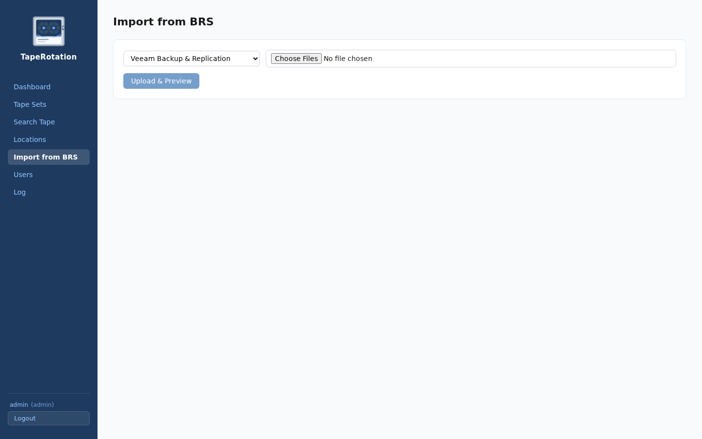

#  TapeRotation

A tracking and rotation system for backup tape cartridges.

---

## Contents

- [Application goals](#application-goals)
- [Functional overview](#functional-overview)
  - [Login](#login)
  - [Dashboard](#dashboard)
  - [Tape sets](#tape-sets)
  - [Set detail page](#set-detail-page)
  - [Tape search](#tape-search)
  - [Locations](#locations)
  - [Users](#users)
  - [Import from backup software](#import-from-backup-software)
  - [Access levels](#access-levels)
  - [Email notifications](#email-notifications)
- [Technology stack](#technology-stack)
- [Deployment on a clean Debian 13 machine](#deployment-on-a-clean-debian-13-machine)
  - [1. System dependencies](#1-system-dependencies)
  - [2. Getting the source code](#2-getting-the-source-code)
  - [3. Configuration](#3-configuration)
  - [4. Backend dependencies](#4-backend-dependencies)
  - [5. Frontend dependencies](#5-frontend-dependencies)
  - [6. Running the app](#6-running-the-app)
  - [7. Autostart via systemd](#7-autostart-via-systemd)
  - [8. Caddy reverse proxy](#8-caddy-reverse-proxy-optional)
- [Deployment via Docker Compose](#deployment-via-docker-compose)
  - [1. Preparing the files](#1-preparing-the-files)
  - [2. Running](#2-running)
  - [3. Updating](#3-updating)
- [Preparing import files for each backup system](#preparing-import-files-for-each-backup-system)
  - [Acronis Cyber Backup](#acronis-cyber-backup)
  - [Bareos / Bacula](#bareos--bacula)
  - [Commvault](#commvault)
  - [Dell EMC NetWorker](#dell-emc-networker)
  - [IBM Spectrum Protect (TSM)](#ibm-spectrum-protect-tsm)
  - [OpenText Data Protector](#opentext-data-protector)
  - [Veeam Backup & Replication](#veeam-backup--replication)
  - [Veritas Backup Exec](#veritas-backup-exec)
  - [Veritas NetBackup](#veritas-netbackup)
  - [Vinchin Backup & Recovery](#vinchin-backup--recovery)
  - [Kiberbackup (Cyberprotect)](#kiberbackup-cyberprotect)

---

## Application goals

- Keep track of where tape cartridges sent for offline storage are physically located
- Track retention periods for tape sets and ensure expired ones are returned to the library on time
- Store information about the contents of each set (which servers, backup type, period)
- Send email warnings about upcoming expirations
- Provide access control for different categories of staff

---

## Functional overview

### Login


### Dashboard

The main screen with an at-a-glance summary: how many sets are in storage, overdue, returned, or expiring soon. Below it are tables of sets ready to be returned and sets expiring within the next 7 days.

### Tape sets

A full list of sets with filtering by status and location, search by tape label and content, and sorting by number, ship date, and expiration date. Statuses:

| Status | Description |
|---|---|
| In storage | The set is in off-site storage, the retention period has not expired |
| Overdue | The retention period has expired, the set can be returned to the library |
| Returned | The set has been returned to the tape library |

Each set stores: name, description, location, recording date, ship date, retention period (days) or the **Forever** flag (∞), expiration date, content (free-form text), and a list of tapes with their LTO version. Sets flagged as "Forever" never get the "Overdue" status and are excluded from email notifications.

### Set detail page

A detailed page for a set: all information about the set, contact details for the person responsible at the location. A list of tapes that can be added, edited (label, LTO version, status) and removed. The **🖨 Print** button opens a print-ready version of the set page. The "Mark as returned" button changes the set's status. The **Change history** section shows all actions performed on the set and its tapes, with the user and timestamp, including recording date, the date it was added to the system, and moves between locations.

### Tape search

Global search by tape label (or part of it) and by set content, across all sets. Results show the label, LTO version, status, and the set with a link to it.

### Locations

A directory of storage locations: name, address, contact person, phone, notes.

### Users *(admin only)*

Manage user accounts: create, change role/password/status/language, delete. When creating a user, the interface language is set — Russian or English. The administrator's language is set via the `ADMIN_LANGUAGE` variable in `.env`.

> **Two interface languages are supported: English and Russian.** Each user (including the admin) has their own language setting, switchable at any time from the Users page. By default, new deployments start in English (`ADMIN_LANGUAGE=en`).

### Import from backup software

Upload media from external backup software in CSV or Excel format. Supported systems:

| Backup software | Note |
|---|---|
| Acronis Cyber Backup | View via Settings → Tapes |
| Bareos / Bacula | `list media` (pipe table) or CSV from the catalog |
| Commvault | Media report from the CommCell Console |
| Dell EMC NetWorker | `mminfo` with CSV output |
| IBM Spectrum Protect (TSM) | `query volume` report |
| OpenText Data Protector | `omnimm -list_media` |
| Veeam Backup & Replication | Tape Library Inventory |
| Veritas Backup Exec | Media Vault or BEMCLI |
| Veritas NetBackup | OpsCenter or `bpmedialist` output |
| Vinchin Backup & Recovery | Export from the web console |
| Kiberbackup (Cyberprotect) | CSV via the `scrape_web_tapes.py` script |

A single file picker dialog lets you select several files at once — sets from all files are merged into one preview list. After uploading, each set is shown as a separate card. All fields are editable before confirming the import: name, description, recording date, retention period (days) or the "Forever" flag, content, and LTO version of each tape. The LTO version is detected automatically from the label (suffix `L7`, `LTO-8`, `ULTRIUM6`, etc).

Set names don't need to be unique — the same set can be imported multiple times, creating a new record each time.

Before importing, you choose the storage location and the import mode:

| Mode | Description |
|---|---|
| Create new set | Always creates a new record, regardless of name |
| Match set by tapes | If ≥ 30% of the tapes in the file match an existing set — merge with it |

### Access levels

| Role | View | Modify data | Manage users |
|---|---|---|---|
| `readonly` | ✓ | — | — |
| `user` | ✓ | ✓ | — |
| `admin` | ✓ | ✓ | ✓ |

### Email notifications
Every day at 08:00 the system checks for expired and soon-to-expire sets and sends an HTML notification to the address set in `NOTIFY_EMAIL`. The email contains a list of sets with links to their detail pages.

Parameters in `.env`:

| Variable | Description |
|---|---|
| `SMTP_HOST` | SMTP server address |
| `SMTP_PORT` | Port (default 25) |
| `SMTP_USER` | Login for authentication (leave empty if not needed) |
| `SMTP_PASSWORD` | Password |
| `SMTP_FROM` | Sender address |
| `NOTIFY_EMAIL` | Notification recipient address |
| `NOTIFY_DAYS_BEFORE` | How many days in advance to warn about expiring sets (default 7) |
| `APP_URL` | Public application address — used in links inside emails |

A manual check run and a test email are available via the API (requires the `admin` role):

```
POST /admin/notify/run   — run the check and send real notifications
POST /admin/notify/test  — send a test email to NOTIFY_EMAIL
```

---

## Technology stack

| Layer | Technology |
|---|---|
| Backend | Python 3.13, FastAPI 0.115, Uvicorn |
| Database | SQLite (file `taperotation.db`) |
| Frontend | React 18, TypeScript, Vite 6 |

---

## Deployment on a clean machine (Debian 13 as an example)

### 1. System dependencies

```bash
apt update
apt install -y python3 python3-pip git curl
```

Installing Node.js via nvm:

```bash
curl -o- https://raw.githubusercontent.com/nvm-sh/nvm/v0.40.1/install.sh | bash
source ~/.bashrc
nvm install 20
nvm use 20
```

### 2. Getting the source code

Clone the repository into any directory you like:

```bash
git clone https://github.com/ElizarovEugene/TapeRotation.git taperotation
cd taperotation
```

### 3. Configuration

Copy the example configuration and edit it:

```bash
cp .env.example .env
nano .env
```

Parameters:

```env
# Generate a random string with: openssl rand -hex 32
JWT_SECRET=replace-with-a-random-string
JWT_EXPIRE_MINUTES=480

ADMIN_USERNAME=admin
ADMIN_PASSWORD=a-strong-password
# Two interface languages are supported: "en" or "ru"
ADMIN_LANGUAGE=en

SMTP_HOST=smtp-server-address
SMTP_PORT=25
SMTP_USER=
SMTP_PASSWORD=
SMTP_FROM=taperotation@your-domain
NOTIFY_EMAIL=admin@your-domain
NOTIFY_DAYS_BEFORE=7

# Public application address — used in links inside email notifications
APP_URL=http://192.168.1.x:5174
# Allowed CORS origins (comma-separated)
CORS_ORIGINS=http://192.168.1.x:5174
```

The database path is resolved automatically relative to the project directory (`taperotation.db` at the repo root). It can be overridden via the `DATABASE_URL` variable in `.env` if needed.

### 4. Backend dependencies

```bash
pip3 install --break-system-packages -r backend/requirements.txt
```

### 5. Frontend dependencies

```bash
cd frontend
npm install
cd ..
```

### 6. Running the app

```bash
./start.sh
```

The application will be available at: `http://<server-IP>:5174`

On first run, an administrator account is automatically created using the login and password from `.env` (`ADMIN_USERNAME` / `ADMIN_PASSWORD`), with the interface language set by `ADMIN_LANGUAGE`.

### 7. Autostart via systemd

Create two units — for backend and frontend.

**Backend** `/etc/systemd/system/taperotation-backend.service`:

```ini
[Unit]
Description=TapeRotation Backend
After=network.target

[Service]
User=korp
WorkingDirectory=/path/to/taperotation/backend
ExecStart=/usr/bin/python3 -m uvicorn app.main:app --host 0.0.0.0 --port 8001
Restart=always
RestartSec=5

[Install]
WantedBy=multi-user.target
```

**Frontend** `/etc/systemd/system/taperotation-frontend.service`:

```ini
[Unit]
Description=TapeRotation Frontend
After=network.target

[Service]
User=korp
WorkingDirectory=/path/to/taperotation/frontend
# The path to npm depends on the user and how Node.js was installed.
# Find the exact path with: which npm  (or: ~/.nvm/versions/node/v20.x.x/bin/npm)
ExecStart=/home/korp/.nvm/versions/node/v20.20.2/bin/npm run dev -- --host 0.0.0.0
Restart=always
RestartSec=5

[Install]
WantedBy=multi-user.target
```

Enable:

```bash
systemctl daemon-reload
systemctl enable --now taperotation-backend taperotation-frontend
```

### 8. Caddy reverse proxy *(optional)*

Add to `Caddyfile`:

```
taperotation.your-domain.ru {
    reverse_proxy localhost:5174
}

taperotation-api.your-domain.ru {
    reverse_proxy localhost:8001
}
```

When using a reverse proxy, update `CORS_ORIGINS` in `.env`:

```env
CORS_ORIGINS=https://taperotation.your-domain.ru
```

And the proxy target in `frontend/vite.config.ts`:

```ts
target: 'http://localhost:8001',
```

---

## Deployment via Docker Compose

Ready-made images are published on Docker Hub:
- [`elizaroveugene/taperotation-backend`](https://hub.docker.com/r/elizaroveugene/taperotation-backend)
- [`elizaroveugene/taperotation-frontend`](https://hub.docker.com/r/elizaroveugene/taperotation-frontend)

### 1. Preparing the files

Create a working directory and the configuration file:

```bash
mkdir taperotation-docker && cd taperotation-docker
```

Create `docker-compose.yml`:

```yaml
services:
  backend:
    image: elizaroveugene/taperotation-backend:latest
    restart: unless-stopped
    env_file: .env
    environment:
      DATABASE_URL: sqlite:////data/taperotation.db
    volumes:
      - db_data:/data

  frontend:
    image: elizaroveugene/taperotation-frontend:latest
    restart: unless-stopped
    ports:
      - "80:80"
    depends_on:
      - backend

volumes:
  db_data:
```

Create `.env` (based on the `.env.example` from the repository):

```env
JWT_SECRET=replace-with-a-random-string
JWT_EXPIRE_MINUTES=480

ADMIN_USERNAME=admin
ADMIN_PASSWORD=a-strong-password
# Two interface languages are supported: "en" or "ru"
ADMIN_LANGUAGE=en

SMTP_HOST=smtp-server-address
SMTP_PORT=25
SMTP_USER=
SMTP_PASSWORD=
SMTP_FROM=taperotation@your-domain
NOTIFY_EMAIL=admin@your-domain
NOTIFY_DAYS_BEFORE=7

APP_URL=http://192.168.1.x
CORS_ORIGINS=http://192.168.1.x
```

### 2. Running

```bash
docker compose up -d
```

The application will be available at: `http://<server-IP>`

On first run, an administrator account is automatically created from `.env` (`ADMIN_USERNAME` / `ADMIN_PASSWORD`). The database is stored in the `db_data` Docker volume and persists across restarts.

### 3. Updating

```bash
docker compose pull
docker compose up -d
```

---

## Preparing import files for each backup system

### Acronis Cyber Backup

View the list of media: **Settings** → **Tapes** → select a pool.

There is no built-in CSV export. Use the [Cyber_Backup_Tape_Export](https://github.com/Kenny856/Cyber_Backup_Tape_Export) script to export it — it's also compatible with Acronis Cyber Backup starting from version 18.1.

---

### Bareos / Bacula

**Option 1 — bconsole** (pipe table, imports directly):

```
bconsole
*list media
```

Copy the output into a text file and upload it as-is.

**Option 2 — query the catalog** (PostgreSQL/MySQL):

```sql
SELECT m.VolumeName,
       p.Name        AS Pool,
       m.LastWritten,
       m.VolRetention,
       m.VolStatus
FROM Media m
JOIN Pool p ON m.PoolId = p.PoolId;
```

Export to CSV (`\copy ... TO 'media.csv' CSV HEADER` for PostgreSQL).

---

### Commvault

**CommCell Console:**
In the left tree: **Storage Resources** → **Libraries** → *[Library name]* → **Media By Location** → **Media in Library**.
In the right panel, select the desired volumes (Ctrl+A — all), right-click → **All Tasks** → **Export to CSV**.

**Command Center (web interface):**
**Storage** → **Tape Libraries** → *[Library name]* → **Media** tab.
In the top-right corner of the table — the ⚙ icon → **Export to CSV**.

Key columns: `Barcode`, `Media Group`, `Start Time`, `Expiration Date`.

---

### Dell EMC NetWorker

Via `mminfo`:

```bash
mminfo -r "volume,pool,created,expires,capacity,used" \
       -q "volume=*" -xc, > networker_media.csv
```

The `-xc,` flag sets the comma as the delimiter (format `-xc<delimiter>`). Add a header manually if needed:

```bash
mminfo -r "volume,pool,created,expires" -q "volume=*" -xc, |
  awk 'BEGIN{print "volume,pool,created,expires"} {print}' > networker_media.csv
```

Or via NMC: **Reports** → **Media** → **Volume Summary** → Export.

Key columns: `volume`, `pool`, `created`, `expires`.

---

### IBM Spectrum Protect (TSM)

Via `dsmadmc`:

```
dsmadmc -id=admin -password=*** -dataonly=yes -comma
  "query volume * f=d" > tsm_volumes.csv
```

Or in Operations Center: **Overview** → **Storage** → **Volumes** → export to CSV.

Key columns: `Volume Name`, `Storage Pool Name`, `Last Use Date`, `Expiration Date`.

---

### OpenText Data Protector

List media via CLI:

```bash
omnimm -list_media > dataprotector_media.txt
```

The output is a fixed-field table. For detailed information about a specific volume:

```bash
omnimm -media_info <label>
```

Or via the GUI: **Media Management** → select a pool → **Tools** → **Export**.

Key columns: `Label`, `Pool`, `Created`, `Valid Until`.

---

### Veeam Backup & Replication

The standard Veeam console has no CSV export for the tape inventory. Use PowerShell on the Veeam server:

```powershell
$pool = Get-VBRTapeMediaPool -Name "Daily Backup"
Get-VBRTapeMedium -MediaPool $pool |
  Select-Object Name, MediaSet, ExpirationDate, LastWriteTime |
  Export-Csv -Encoding UTF8 -NoTypeInformation veeam_media.csv
```

Key columns: `Name` (label), `MediaSet` (set), `ExpirationDate`, `LastWriteTime`.

---

### Veritas Backup Exec

**Via the console**:

Storage → Media Vault → select media → right-click → **Export** → CSV.

**Via BEMCLI (PowerShell)**:

```powershell
Get-BEMedia | Select-Object Label, MediaSet, LastWrittenDate, ExpirationDate, Status |
  Export-Csv -Encoding UTF8 -NoTypeInformation backupexec_media.csv
```

Key columns: `Label`, `Media Set`, `Last Written Date`, `Expiration Date`.

---

### Veritas NetBackup

**Option 1 — OpsCenter**:

OpsCenter → **Reports** → **Operational** → **Tape** → **Media** → **Export** → CSV.

**Option 2 — bpmedialist**:

```bash
bpmedialist -l -mlist > netbackup_media.txt
```

Upload the file as-is — the parser recognizes the text format automatically.

Key columns: `Media ID`, `Volume Pool`, `Allocated`, `Expiration Date`.

---

### Vinchin Backup & Recovery

Web console → **Tape Library** → **Media Management** → select media → **Export** → CSV or Excel.

Key columns: `Tape Barcode`, `Pool`, `Last Write Time`, `Expiry Date`.

---

### Kiberbackup (Cyberprotect)

There is no built-in media export to CSV. Use the [Cyber_Backup_Tape_Export](https://github.com/Kenny856/Cyber_Backup_Tape_Export) script to export it.
